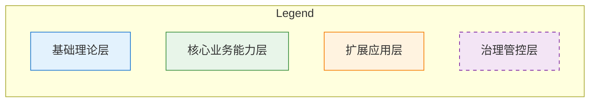

# Networked Knowledge Graph Design Reference

## Table of Contents
- [Node Definition](#node-definition)
- [Relationship Edge Definition](#relationship-edge-definition)
- [Visualization Rendering Rules](#visualization-rendering-rules)
- [Graph Data JSON Schema](#graph-data-json-schema)
- [Clustering & Layout Strategy](#clustering--layout-strategy)

---

## Node Definition

Each knowledge point is an independent node.

### Node Attributes

| Attribute | Type | Description |
|-----------|------|-------------|
| id | string | Unique identifier (e.g., "KP_001") |
| name | string | Knowledge point name |
| definition | string | One-sentence definition summary |
| layer | enum | foundation / capability / application / governance |
| domain | string | Knowledge domain cluster |
| difficulty | enum | entry / basic / intermediate / advanced |
| confidence | float | Classification confidence (0-1) |
| status | enum | confirmed / pending |

### Node Visual Styling by Layer

Use distinct styles for each layer to aid visual recognition:

```
Layer 1 (基础理论层):   Rounded rectangle, light blue fill (#E3F2FD), blue border
Layer 2 (核心业务能力层): Rectangle, light green fill (#E8F5E9), green border
Layer 3 (扩展应用层):   Hexagon, light orange fill (#FFF3E0), orange border
Layer 4 (治理管控层):   Rectangle with dashed border, light purple fill (#F3E5F5), purple border
```

### Node Size Rules

- **Core nodes** (degree >= 5): Larger size, bold text
- **Standard nodes** (degree 2-4): Normal size
- **Edge nodes** (degree <= 1): Smaller size, lighter text

---

## Relationship Edge Definition

| Relationship | Direction | Notation | Description | Visual Style |
|-------------|-----------|----------|-------------|--------------|
| 从属 (subordinate) | Directed | A --> B | Child concept -> parent concept | Solid arrow, thin |
| 依赖 (dependency) | Directed | A --> B | Prerequisite -> dependent | Solid arrow, bold, labeled "依赖" |
| 关联 (association) | Undirected | A --- B | Peer-level strong correlation | Dashed line, no arrow |
| 组成 (composition) | Directed | A --> B | Component -> whole | Solid arrow, labeled "组成" |
| 演化 (evolution) | Directed | A --> B | Old concept -> new concept | Dotted arrow, labeled "演化" |

### Edge Weight

Assign weights (0-1) to edges based on relationship strength:
- **Strong** (>= 0.7): Direct prerequisite, core composition, tight coupling
- **Medium** (0.4-0.6): Indirect dependency, partial overlap, common scenario
- **Weak** (< 0.4): Peripheral association, avoid drawing if confidence is low

---

## Visualization Rendering Rules

1. **Cluster by knowledge domain**: Group same-domain nodes together using Mermaid subgraphs
2. **Dependency = solid arrow, Association = dashed line**: Always distinguish
3. **Core node emphasis**: Enlarge high-degree nodes, shrink edge nodes
4. **Directional clarity**: Directed relationships must have arrowheads
5. **Density control**: If graph has > 25 nodes, split into domain-specific subgraphs with cross-domain edges summarized
6. **Legend**: Always include a legend explaining node colors and edge types

### Layer Color Legend



---

## Graph Data JSON Schema

Preserve complete graph data in JSON for tool import (D3.js, Draw.io, etc.):

```json
{
  "domain": "领域名称",
  "nodes": [
    {
      "id": "KP_001",
      "name": "术语名称",
      "definition": "定义摘要",
      "layer": "foundation",
      "domain_cluster": "知识域A",
      "difficulty": "basic",
      "confidence": 0.85,
      "status": "confirmed"
    }
  ],
  "edges": [
    {
      "source": "KP_001",
      "target": "KP_002",
      "type": "dependency",
      "weight": 0.8,
      "label": "依赖"
    }
  ],
  "clusters": [
    {
      "name": "知识域A",
      "node_ids": ["KP_001", "KP_002", "KP_003"]
    }
  ]
}
```

---

## Clustering & Layout Strategy

### Domain Cluster Identification

1. Group nodes by their `domain_cluster` attribute
2. Each cluster becomes a Mermaid subgraph
3. Name subgraphs with the domain cluster name
4. Place related clusters adjacent to each other

### Cross-Cluster Edges

- Draw cross-cluster edges explicitly to show inter-domain relationships
- If cross-cluster edges are too many (> 10), summarize as a single labeled connector

### Large Graph Handling

When total nodes exceed thresholds:

| Node Count | Strategy |
|-----------|----------|
| 1-15 | Single graph, all nodes visible |
| 16-25 | Single graph with subgraph clustering |
| 26-50 | Split by knowledge domain into multiple subgraphs; provide overview graph showing cluster relationships |
| 50+ | Provide layer-by-layer drill-down; start with domain trunk, allow user to expand specific clusters |
