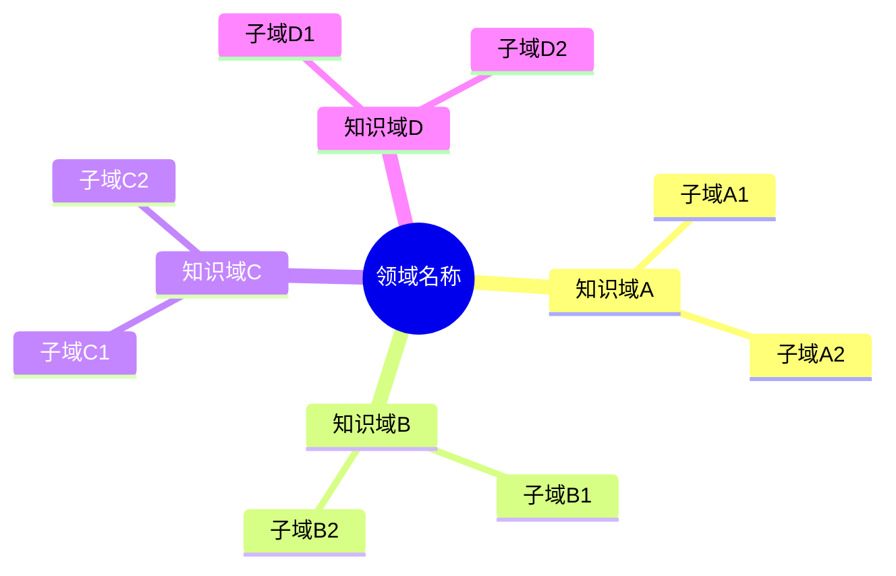
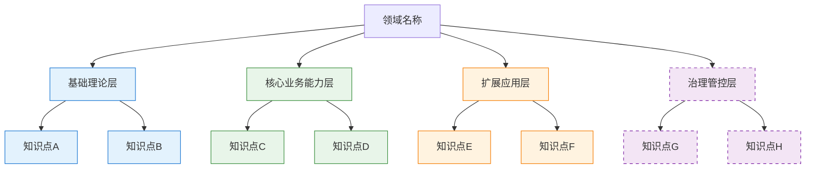
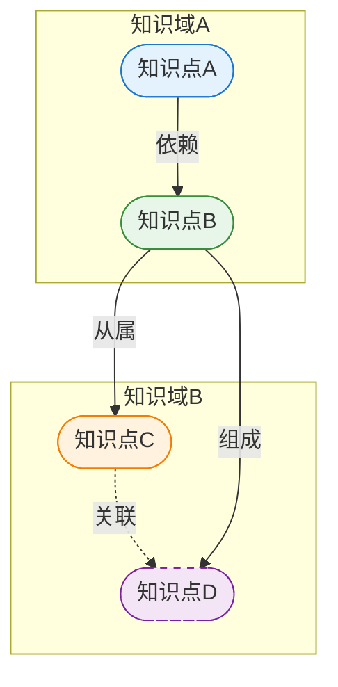
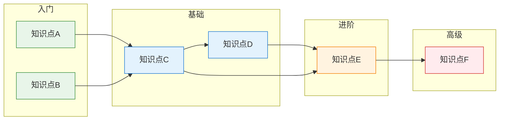
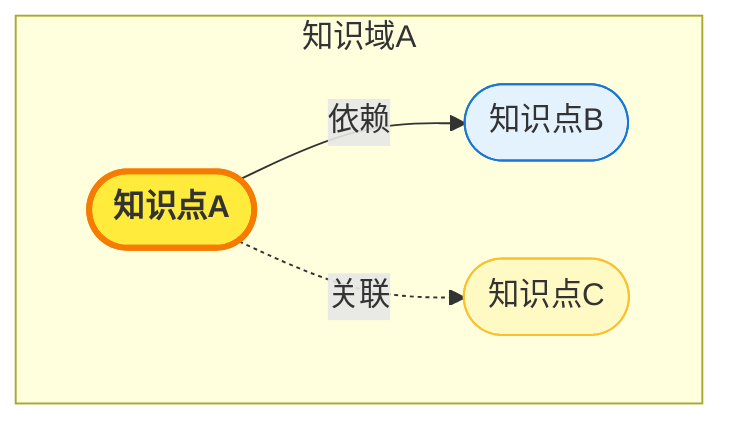

# Query Layer & Visualization Patterns Reference

## Table of Contents
- [Query Layer Capabilities](#query-layer-capabilities)
- [Mermaid Templates](#mermaid-templates)
- [Output Assembly Guide](#output-assembly-guide)

---

## Query Layer Capabilities

All query results sync with graph node highlighting.

### 1. Node Precision Query

**Input**: Single domain term
**Output**:
- Complete term card (definition, layer, domain, difficulty)
- Prerequisite knowledge chain (upstream)
- Extension knowledge chain (downstream)
- Related nodes list (with relationship types)
- Highlighted position in the networked graph (Mermaid with focus node styled differently)

**Output template**:
```markdown
### [Term Name] 知识详情

**标准定义**: ...
**所属层级**: 核心业务能力层 (confidence: 0.9)
**所属知识域**: ...
**学习难度**: 进阶

#### 前置知识
- [Prerequisite 1] (依赖)
- [Prerequisite 2] (依赖)

#### 延伸知识
- [Extension 1] (从属)
- [Extension 2] (关联)

#### 关联节点
| 节点 | 关系类型 | 说明 |
|------|---------|------|

#### 网状图谱位置
[Mermaid graph with this node highlighted in distinct color]
```

### 2. Layer / Domain Query

**Input**: Specified layer name or knowledge domain
**Output**:
- All knowledge points within scope (list)
- Tree structure view
- Internal relationship sub-network
- Local networked subgraph

**Output template**:
```markdown
### [Layer/Domain] 知识清单

#### 知识点清单
| # | 知识点 | 层级 | 难度 | 关联数 |
|---|--------|------|------|--------|

#### 树形结构
[Mermaid tree diagram of this layer/domain]

#### 局部网状图谱
[Mermaid graph showing only nodes and edges within this scope]
```

### 3. Scenario Assembly Query

**Input**: Specific business scenario or problem
**Output**:
- Required knowledge component checklist
- Assembly orchestration order
- Corresponding knowledge point dependency chain
- Scenario-specific subgraph

**Output template**:
```markdown
### 场景：[Scenario Name]

#### 知识组件清单
| # | 知识组件 | 所属层级 | 在场景中的角色 |
|---|---------|---------|---------------|

#### 组装编排流程
1. [Step 1: knowledge component + action]
2. [Step 2: knowledge component + action]
...

#### 依赖链路
[Mermaid flowchart showing dependency chain for this scenario]

#### 场景专属子图谱
[Mermaid graph with only scenario-relevant nodes and edges]
```

### 4. Learning Path Query

**Input**: Target knowledge point or learning goal
**Output**:
- Complete path from zero to target
- Prerequisite checklist
- Staged learning nodes
- Learning path DAG

**Output template**:
```markdown
### 学习路线：[Target Knowledge Point]

#### 前置知识清单
- [ ] [Prerequisite 1] (入门)
- [ ] [Prerequisite 2] (基础)
- [ ] [Prerequisite 3] (进阶)

#### 分阶段学习节点
**阶段1 - 入门**: [nodes]
**阶段2 - 基础**: [nodes]
**阶段3 - 进阶**: [nodes]
**阶段4 - 高级**: [target node]

#### 路线DAG图
[Mermaid flowchart LR showing layered DAG]
```

### 5. Blind Spot & Dimension Query

**Input**: Dimension combination or "知识盲区"
**Output**:
- Knowledge point list for the specified dimension intersection
- Current system blind spot list
- Gap-filling suggestions

**Output template**:
```markdown
### 维度查询：[Dimension A] x [Dimension B]

#### 交叉单元格知识点
| [Dim A] \ [Dim B] | Value1 | Value2 | Value3 |
|-------------------|--------|--------|--------|
| Item1             | KP1,KP2| KP3    | ⚠️ 盲区 |
| Item2             | KP4    | KP5,KP6| KP7    |

#### 知识盲区清单
1. [Blind spot 1] - 建议补充：[suggestion]
2. [Blind spot 2] - 建议补充：[suggestion]

#### 补全建议
- [Actionable suggestion 1]
- [Actionable suggestion 2]
```

---

## Mermaid Templates

### 1. Domain Trunk Mindmap (Top Layer)

Use bilateral center-symmetric tree. Split branches evenly left and right.



**Layout rule**: Balance left/right branch count. If odd number of domains, put the extra one on the side with fewer sub-nodes.

### 2. Four-Layer Framework Tree



### 3. Knowledge Matrix (Markdown Table)

```markdown
| 知识层级 \ 业务场景 | 场景A | 场景B | 场景C |
|---------------------|-------|-------|-------|
| 基础理论层 | ◼️ KP1, KP2 | ◻️ KP3 | ⚠️ 盲区 |
| 核心业务能力层 | ◼️◼️ KP4, KP5, KP6 | ◼️ KP7 | ◻️ KP8 |
| 扩展应用层 | ◻️ KP9 | ◼️◼️ KP10, KP11 | ⚠️ 盲区 |
| 治理管控层 | ⚠️ 盲区 | ◻️ KP12 | ◼️ KP13 |

图例：◼️◼️ 高密度 | ◼️ 中密度 | ◻️ 低密度 | ⚠️ 盲区
```

### 4. Networked Knowledge Graph (Core)

Use subgraphs for domain clustering. Apply layer-based styling.



**Edge style rules**:
- `-->` solid arrow: directed relationship (从属, 依赖, 组成, 演化)
- `-.->` dashed arrow: weak directed relationship
- `---` solid line: undirected association
- `-.-` dashed line: weak undirected association

### 5. Learning Path DAG

Use flowchart LR for left-to-right learning progression.



### 6. Highlighted Node Graph (for Query Results)

When rendering query results, highlight the queried node:



**Highlight rules**:
- Queried node: bright yellow fill (#FFEB3B), bold border, 3px stroke
- Directly related nodes: light yellow fill (#FFF9C4)
- Unrelated nodes: normal layer color but reduced opacity

---

## Output Assembly Guide

### Complete Build Output Order

When presenting the full knowledge system build results, follow this sequence:

1. **Framework overview** (text + tree) - 4-layer structure with all terms classified
2. **Domain trunk mindmap** - bilateral center tree showing domain clusters
3. **Knowledge matrix** - markdown table with density and blind spot markers
4. **Networked knowledge graph** - clustered Mermaid graph + JSON data
5. **Learning path DAG** - flowchart LR with 4 difficulty tiers
6. **Interactive prompt** - guide user to query

### Query Response Output Order

When responding to a specific query:

1. **Query result summary** (text) - direct answer to the query
2. **Detail card or table** - structured data
3. **Visualization** - Mermaid graph with appropriate highlighting
4. **Follow-up prompt** - suggest related queries or next steps

### JSON Data Output

Always preserve complete structured data alongside visualizations. Output as a fenced JSON code block:

```json
{
  "domain": "...",
  "framework": { ... },
  "nodes": [ ... ],
  "edges": [ ... ],
  "clusters": [ ... ],
  "learning_paths": [ ... ]
}
```
